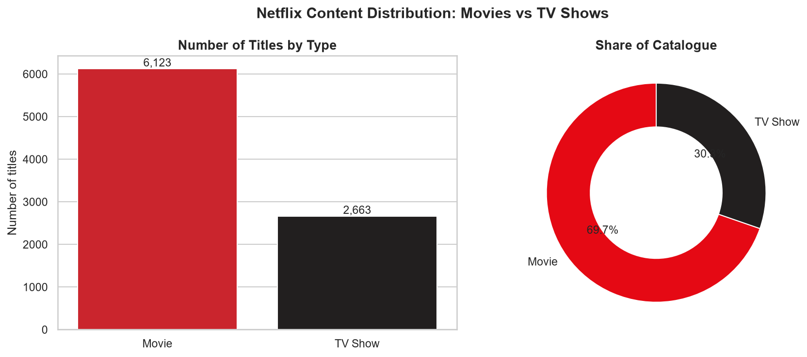
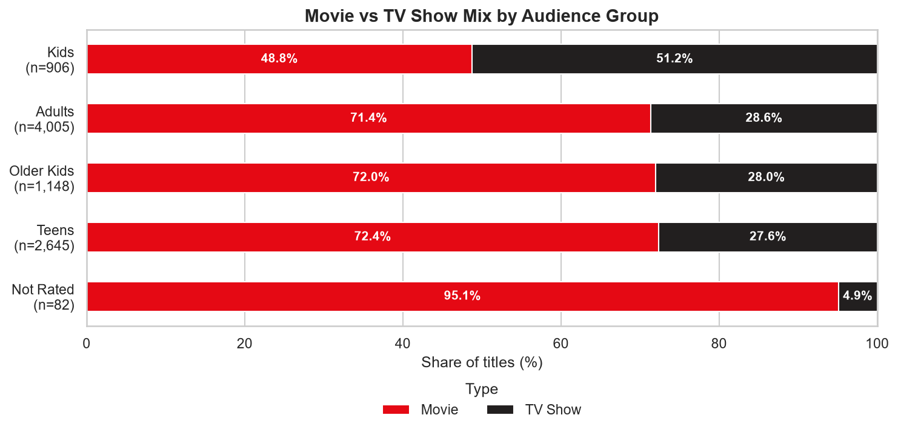
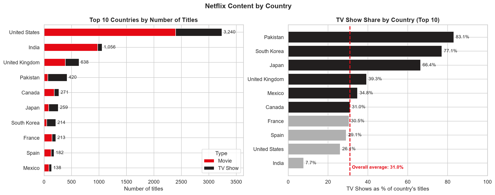
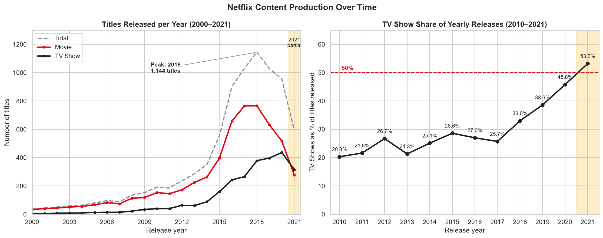
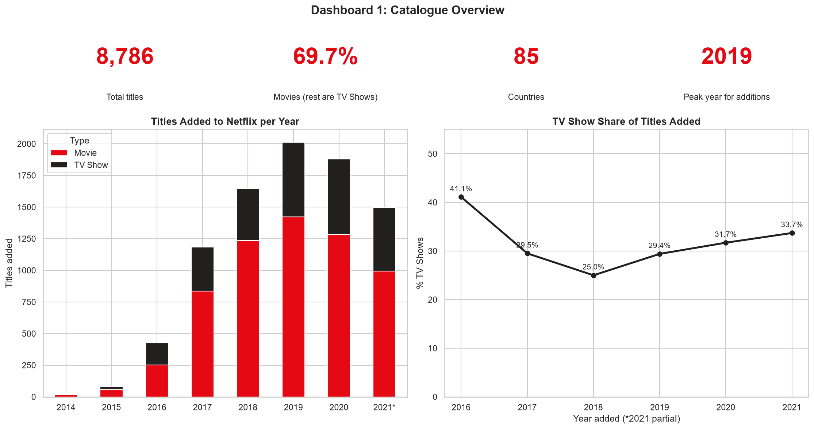
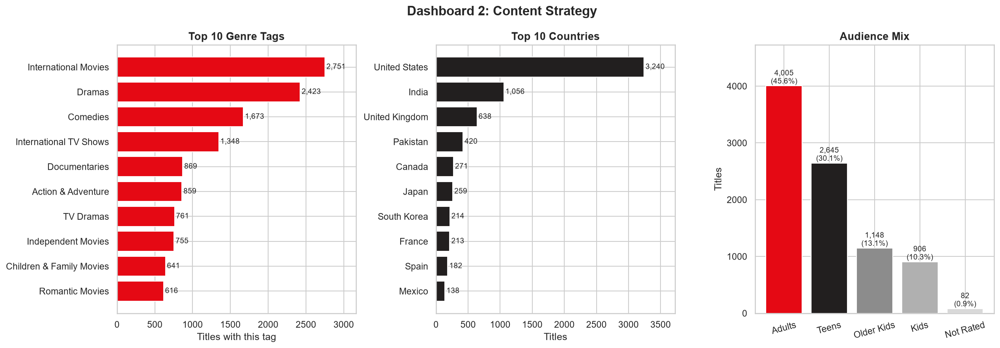
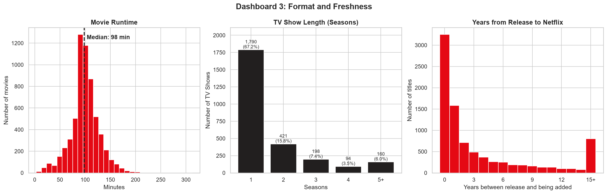

# Netflix Data Analysis — Auspify Internship Project

Data analysis project completed for the Auspify Technologies "Data Analysis Using Python" internship.

**Tools:** Python, Pandas, NumPy, Matplotlib, Seaborn, Jupyter

## Key findings

- **Catalogue growth has not stalled.** Over the same 1 Jan to 25 Sep window each year, titles added rose from 1,363 (2020) to 1,498 (2021), **+9.9%**. The full-year 2021 figure looks lower only because the data ends in September.
- **TV Shows are growing fastest.** TV Show additions rose 20.5% in 2021 versus 5.2% for Movies. The catalogue is 69.7% Movies and 30.3% TV Shows overall.
- **Content supply is concentrated.** The United States supplies 38.1% of titles with a known country, and the top 3 countries supply 58.1%. The US share of additions rose from 31.7% (2018) to 41.5% (2021).
- **Long-running series are scarce.** 67.2% of TV Shows have a single season; only 17.0% have three or more.
- **The library is ageing.** Titles added within a year of release fell from 65.7% (2016) to 50.8% (2021).

All findings describe the **catalogue**, not viewership or revenue.

## Tasks completed

| Task | Level | Notebook | Summary |
|---|---|---|---|
| 1. Data Cleaning & Preparation | Easy | `task1_data_cleaning.ipynb` | Handled hidden missing values, removed 4 duplicates, standardized Country, Rating and Type, exported a clean dataset |
| 2. Content Type Analysis | Easy | `task2_content_type_analysis.ipynb` | Movies vs TV Shows overall and by audience group |
| 3. Country-Wise Content Analysis | Medium | `task3_country_analysis.ipynb` | Country rankings, concentration and TV Show share by country |
| 4. Trend Analysis by Release Year | Medium | `task4_trend_analysis.ipynb` | Year-over-year growth, 2018 peak, shift from Movies to TV Shows |
| 6. Business Insights Report | Advanced | `task6_business_insights_report.ipynb` | Full EDA, three dashboards and six actionable recommendations |

The internship requires any 4 of 6 tasks. Task 5 (Content Rating & Genre Analysis) was not part of this submission.

## Final report

**[Netflix Business Insights Report (PDF)](reports/Netflix_Business_Insights_Report.pdf)**: a 4-page report with an executive summary, three dashboards, six insights with evidence and recommended actions, and data notes.

## Screenshots

| | |
|---|---|
|  |  |
|  |  |

**Task 6 dashboards**





## Data cleaning summary

- Missing values were hidden as the text `"Not Given"`. They were labelled `"Unknown"` instead of dropping about 29% of the rows
- Whitespace was stripped **before** de-duplicating, which exposed a 4th hidden duplicate
- `date_added` was converted to a date, and `year_added` was created
- Ratings `NR` and `UR` were merged into `Not Rated`, and ratings were grouped into five audience categories

## Project structure

```
├── data/
│   ├── raw/Dataset.csv
│   └── processed/netflix_cleaned.csv
├── notebooks/
│   ├── task1_data_cleaning.ipynb
│   ├── task2_content_type_analysis.ipynb
│   ├── task3_country_analysis.ipynb
│   ├── task4_trend_analysis.ipynb
│   └── task6_business_insights_report.ipynb
├── reports/
│   └── Netflix_Business_Insights_Report.pdf
├── screenshots/
├── requirements.txt
└── README.md
```

## Limitations

- Counts show catalogue composition, not viewership, popularity or revenue.
- Each title records one country, so co-productions are credited to a single country.
- Data ends on 25 September 2021, so 2021 is a partial year.
- Audience groups are derived from rating labels and are approximate.

## About

Completed as part of the Auspify Technologies internship program